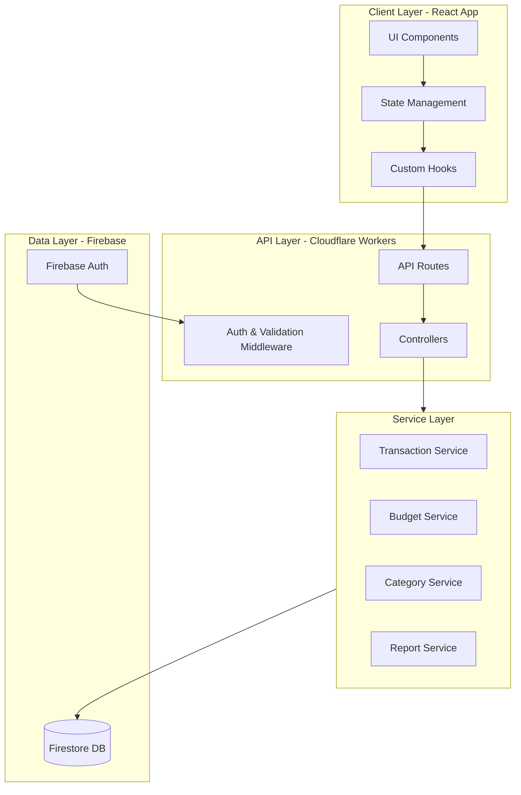

# Fluxo de Caixa Pessoal - Architecture Document

## Project Overview

**Name:** Fluxo de Caixa Pessoal (Personal Cash Flow Management)
**Type:** Web Application
**Stack:** React + Cloudflare Workers + Firebase
**Hosting:** Cloudflare Pages (Frontend) + Cloudflare Workers (Backend)

## Requirements Summary

Based on the project requirements:

1. **Technology Stack:** React frontend + Cloudflare Workers backend
2. **Database:** Firebase (Firestore)
3. **Hosting:** Cloudflare Pages (Frontend) + Cloudflare Workers (API)
3. **Features:**
   - Transaction tracking (income/expenses)
   - Budget management
   - Categories for transactions
   - Monthly reports
4. **Platform:** Web App
5. **Integrations:** None for now

## Architecture Overview



## MCP Server Architecture

### What is MCP?

MCP (Model Context Protocol) servers provide external capabilities to AI assistants. For this project, we need MCP servers that can:

1. **Interact with Firebase** - Read/write transactions, budgets, categories
2. **Generate Reports** - Calculate monthly summaries, spending analytics
3. **Data Validation** - Ensure data integrity before writes

### Required MCP Servers

#### 1. Firebase MCP Server

**Purpose:** Direct interaction with Firebase services

**Capabilities:**
- Read/Write to Firestore collections
- Query transactions by date range, category, type
- Manage user authentication
- Real-time updates via Firebase listeners

**Tools:**
- `firestore_query` - Query documents with filters
- `firestore_insert` - Add new documents
- `firestore_update` - Update existing documents
- `firestore_delete` - Remove documents
- `auth_get_user` - Get current user info

#### 2. Analytics MCP Server

**Purpose:** Financial calculations and reporting

**Capabilities:**
- Calculate monthly income/expense totals
- Generate spending by category reports
- Budget vs actual spending analysis
- Trend analysis over time periods

**Tools:**
- `calculate_monthly_summary` - Monthly financial overview
- `calculate_category_breakdown` - Spending by category
- `calculate_budget_variance` - Budget vs actual
- `generate_trend_report` - Historical trends

#### 3. Validation MCP Server

**Purpose:** Data validation and business rules

**Capabilities:**
- Validate transaction data before saving
- Check budget limits
- Validate date formats and ranges
- Ensure required fields are present

**Tools:**
- `validate_transaction` - Validate transaction fields
- `validate_budget` - Validate budget constraints
- `validate_date_range` - Validate date inputs

## Skills/Hooks Architecture

### What are Skills/Hooks?

Skills (or hooks) are reusable capabilities that can be invoked during development to perform specific tasks related to the project domain.

### Required Skills

#### 1. Transaction Management Skill

**Purpose:** CRUD operations for transactions

**Hooks:**
- `create_transaction` - Add new income/expense
- `get_transactions` - List transactions with filters
- `update_transaction` - Modify existing transaction
- `delete_transaction` - Remove transaction
- `get_transaction_by_id` - Fetch single transaction

**Input Schema:**
```typescript
interface Transaction {
  id?: string;
  type: 'income' | 'expense';
  amount: number;
  category: string;
  description: string;
  date: string; // ISO 8601
  userId: string;
  createdAt?: string;
  updatedAt?: string;
}
```

#### 2. Category Management Skill

**Purpose:** Manage transaction categories

**Hooks:**
- `create_category` - Add new category
- `get_categories` - List all categories
- `update_category` - Modify category
- `delete_category` - Remove category

**Input Schema:**
```typescript
interface Category {
  id?: string;
  name: string;
  type: 'income' | 'expense';
  color: string; // hex color for UI
  icon?: string;
  userId: string;
}
```

#### 3. Budget Management Skill

**Purpose:** Budget planning and tracking

**Hooks:**
- `create_budget` - Set budget for category/period
- `get_budgets` - List all budgets
- `update_budget` - Modify budget
- `delete_budget` - Remove budget
- `check_budget_status` - Compare spending vs budget

**Input Schema:**
```typescript
interface Budget {
  id?: string;
  categoryId: string;
  amount: number;
  period: 'monthly' | 'yearly';
  startDate: string;
  userId: string;
}
```

#### 4. Reporting Skill

**Purpose:** Generate financial reports

**Hooks:**
- `generate_monthly_report` - Monthly summary
- `generate_category_report` - Spending by category
- `generate_trend_report` - Historical analysis
- `export_report` - Export to CSV/PDF

**Input Schema:**
```typescript
interface ReportRequest {
  type: 'monthly' | 'category' | 'trend';
  startDate: string;
  endDate: string;
  userId: string;
  format?: 'json' | 'csv' | 'pdf';
}
```

## Database Schema (Firebase Firestore)

### Collections

```
users/{userId}
  - email: string
  - displayName: string
  - createdAt: timestamp
  - settings: object

categories/{categoryId}
  - userId: reference
  - name: string
  - type: 'income' | 'expense'
  - color: string
  - icon: string
  - createdAt: timestamp

transactions/{transactionId}
  - userId: reference
  - type: 'income' | 'expense'
  - amount: number
  - categoryId: reference
  - description: string
  - date: timestamp
  - createdAt: timestamp
  - updatedAt: timestamp

budgets/{budgetId}
  - userId: reference
  - categoryId: reference
  - amount: number
  - period: 'monthly' | 'yearly'
  - startDate: timestamp
  - createdAt: timestamp
```

## File Structure

```
fluxo-de-caixa-pessoal/
├── .kilocode/
│   └── rules.md
├── plans/
│   └── architecture.md
├── frontend/                 # React Application
│   ├── public/
│   ├── src/
│   │   ├── components/       # Reusable UI components
│   │   ├── pages/           # Page components
│   │   ├── hooks/           # Custom React hooks
│   │   ├── services/        # API service calls
│   │   ├── context/         # React context providers
│   │   ├── utils/           # Utility functions
│   │   ├── types/           # TypeScript types
│   │   └── firebase/        # Firebase configuration
│   ├── package.json
│   └── tsconfig.json
├── backend/                  # Cloudflare Workers API
│   ├── src/
│   │   ├── routes/          # API routes
│   │   ├── controllers/     # Route controllers
│   │   ├── services/        # Business logic
│   │   ├── middleware/      # Auth middleware
│   │   ├── models/          # Data models
│   │   └── utils/           # Utility functions
│   ├── wrangler.toml        # Cloudflare Workers config
│   ├── package.json
│   └── tsconfig.json
├── mcp-servers/             # MCP Server implementations
│   ├── firebase-mcp/
│   ├── analytics-mcp/
│   └── validation-mcp/
└── README.md
```

## Implementation Phases

### Phase 1: Foundation
1. Set up React project with TypeScript + Vite
2. Configure Firebase (Auth + Firestore)
3. Create basic folder structure
4. Set up Cloudflare Workers API skeleton with Wrangler

### Phase 2: Core Features
1. Implement authentication
2. Create category management
3. Build transaction CRUD
4. Basic dashboard UI

### Phase 3: Budget & Reports
1. Budget management features
2. Monthly reports
3. Category breakdown charts
4. Data visualization

### Phase 4: MCP Integration
1. Implement Firebase MCP server
2. Create Analytics MCP server
3. Build Validation MCP server
4. Test all integrations

## Security Considerations

1. **Authentication:** Firebase Auth with JWT tokens
2. **Authorization:** Row-level security in Firestore rules
3. **Validation:** Server-side validation for all inputs
4. **Data Privacy:** User data isolation (userId-based access)

## Cloudflare-Specific Considerations

### Backend (Cloudflare Workers)

**Why Cloudflare Workers:**
- Edge deployment for low latency
- Serverless - no server management
- Generous free tier
- Native integration with Cloudflare Pages

**Key Differences from Traditional Node.js:**
- No Node.js runtime - uses V8 Isolates
- Must use Workers-compatible libraries
- Environment variables via Wrangler secrets
- CORS configuration for frontend communication

**Firebase Integration in Workers:**
- Use Firebase REST API or JWT verification
- Store Firebase service account as Wrangler secret
- Implement JWT middleware for auth verification

### Frontend (Cloudflare Pages)

**Configuration:**
- Build command: `npm run build`
- Build output directory: `dist`
- Root directory: `frontend/`
- Environment variables for Firebase config

**API Integration:**
- Call Cloudflare Workers backend via fetch
- CORS preflight handling
- JWT token management

## Next Steps

1. Review and approve this architecture
2. Create detailed implementation plan
3. Set up project scaffolding
4. Begin Phase 1 development
5. Configure Cloudflare account and projects
