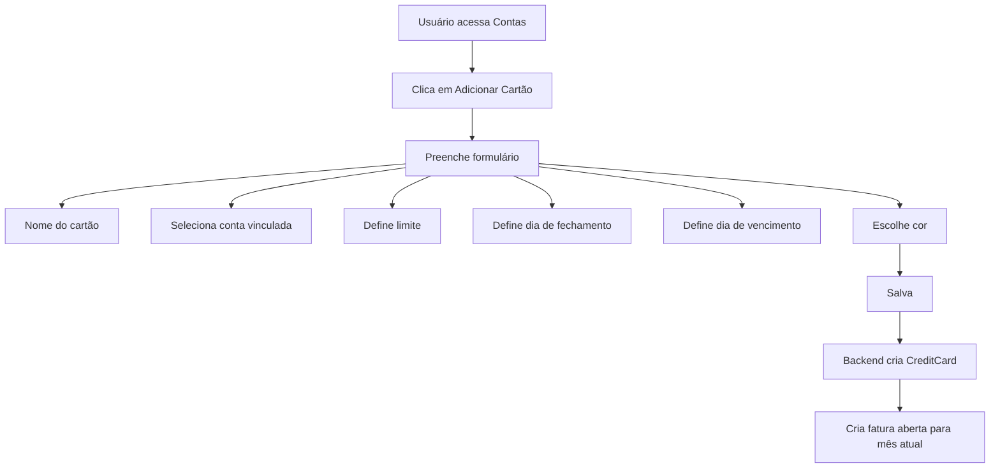
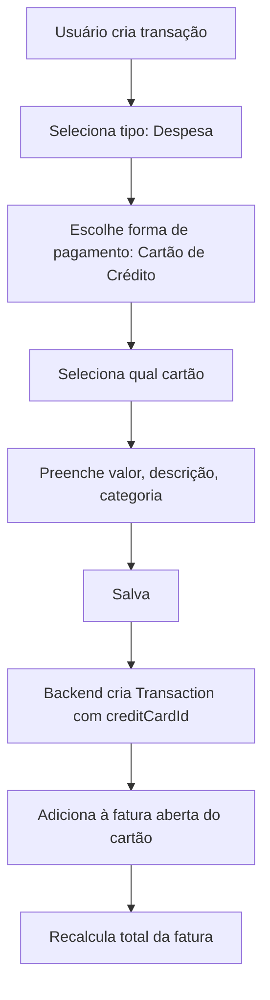
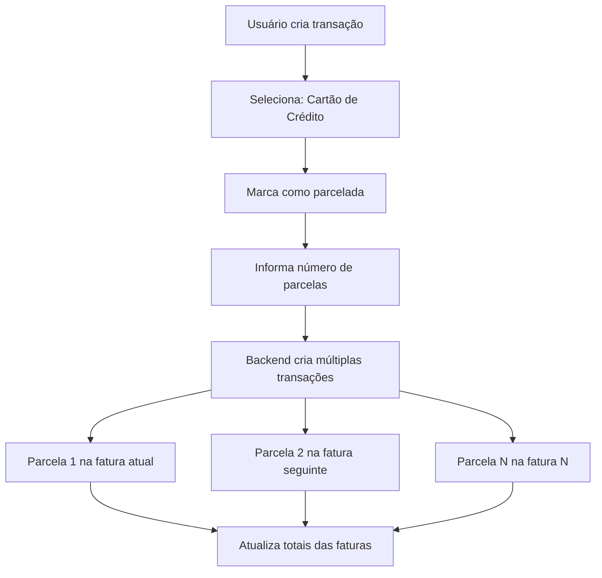
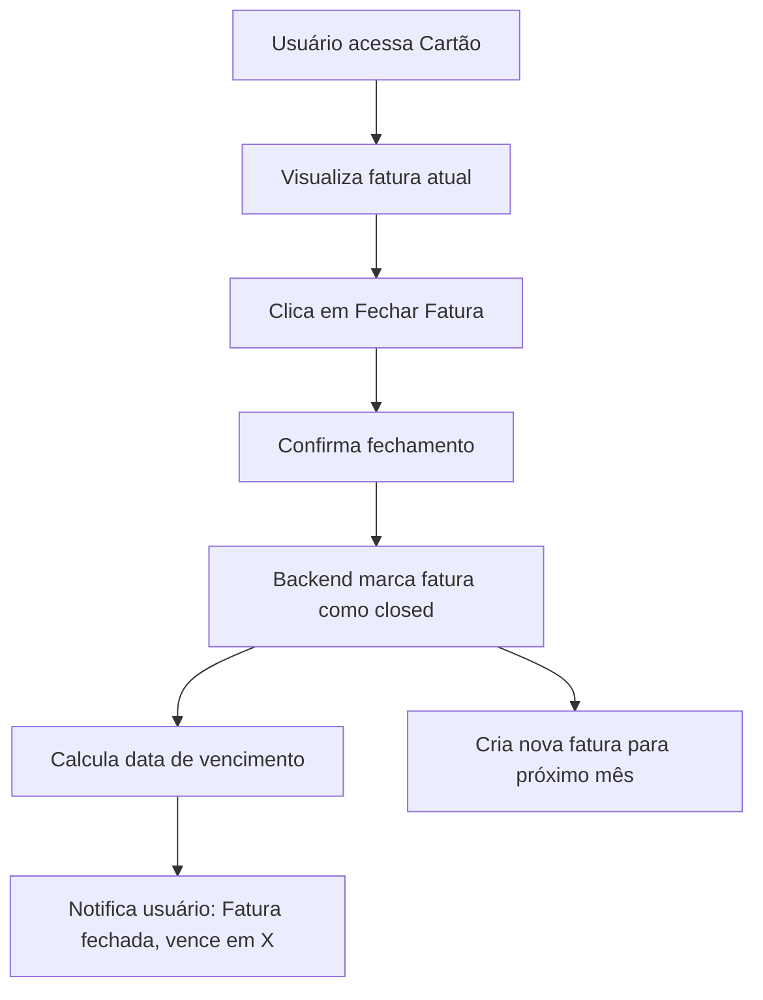
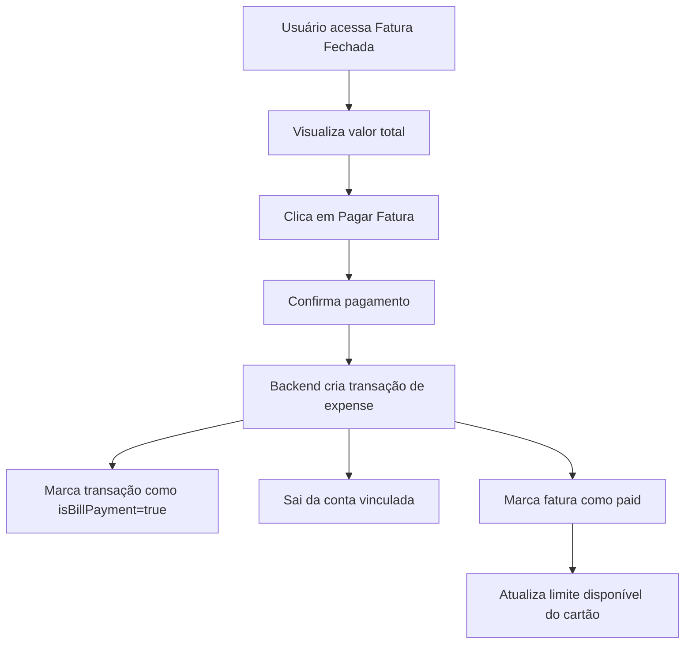

# Plano de Implementação - Cartão de Crédito

> **Branch**: `feature/credit-card`
>
> Criar nova branch a partir de `main` para desenvolvimento desta funcionalidade.

## Visão Geral
Implementar funcionalidade de cartão de crédito no sistema de Fluxo de Caixa Pessoal, permitindo:
- Cadastro de cartões de crédito vinculados a contas bancárias
- Configuração de limite, dia de fechamento e vencimento
- Registro de compras no cartão (com suporte a parcelas)
- Visualização e pagamento de faturas
- Controle de limite disponível
- Fechamento manual de fatura pelo usuário

**Objetivo Principal**: Tornar transparente para o usuário de onde vem cada dívida - fatura do cartão, empréstimo, etc.

---

## Decisões de Arquitetura (Baseadas no Feedback)

### ✅ Modelo de Dados: Cartão como Forma de Pagamento
O cartão NÃO será uma extensão de Account. Em vez disso:
- Cartão é uma **forma de pagamento** associada a uma conta
- Pagamento no débito/PIX = saída direta da conta
- Pagamento no crédito = entrada na fatura do cartão (dívida futura)
- Isso torna transparente a origem da dívida para o usuário

### ✅ Fluxo de Pagamento: Transação de Saída
- Pagamento da fatura = transação tipo `expense` com categoria específica
- NÃO é transferência (o dinheiro sai da conta, mas não vai para lugar nenhum, paga a dívida)

### ✅ Fechamento da Fatura: Manual
- Usuário fecha a fatura quando quiser (ou no dia configurado)
- Não há fechamento automático
- Após fechamento, a fatura fica "pendente de pagamento"

### ✅ Parcelas: Suporte desde o início
- Compras podem ser parceladas
- Cada parcela é uma transação separada na fatura

### ✅ Múltiplos Cartões: Sim
- Vários cartões podem ser vinculados à mesma conta bancária

---

## Modelo de Dados

### 1. Interface CreditCard (Nova)
```typescript
interface CreditCard {
  id: string;
  userId: string;
  name: string;                   // Nome do cartão (ex: "Nubank", "Itaú")
  linkedAccountId: string;        // Conta bancária vinculada (para pagamento)
  creditLimit: number;            // Limite total do cartão
  closingDay: number;             // Dia do fechamento (1-31)
  dueDay: number;                 // Dia do vencimento (1-31)
  color?: string;                 // Cor para identificação visual
  createdAt: string;
  updatedAt: string;
}
```

### 2. Interface CreditCardBill (Fatura)
```typescript
interface CreditCardBill {
  id: string;
  userId: string;
  creditCardId: string;           // ID do cartão
  month: number;                  // Mês da fatura (1-12)
  year: number;                   // Ano da fatura
  closingDate?: string;           // Data de fechamento (quando usuário fechar)
  dueDate: string;                // Data de vencimento calculada
  totalAmount: number;            // Valor total da fatura
  isClosed: boolean;              // Fatura foi fechada?
  isPaid: boolean;                // Fatura foi paga?
  paidAt?: string;                // Data do pagamento
  paidFromAccountId?: string;     // Conta usada para pagar
  createdAt: string;
  updatedAt: string;
}
```

### 3. Extensão da Transaction
```typescript
interface Transaction {
  // ... campos existentes ...
  
  // Novos campos para transações de cartão
  creditCardId?: string;          // ID do cartão usado (para compras no crédito)
  billId?: string;                // ID da fatura vinculada
  installmentNumber?: number;     // Número da parcela (1, 2, 3...)
  totalInstallments?: number;     // Total de parcelas
  
  // Campo para identificar pagamento de fatura
  isBillPayment?: boolean;        // true = esta transação é pagamento de fatura
  paidBillId?: string;            // ID da fatura paga (se isBillPayment=true)
}
```

### 4. Nova Coleção: CreditCards
Coleção separada no Firestore: `creditCards`

### 5. Nova Coleção: CreditCardBills
Coleção separada no Firestore: `creditCardBills`

---

## Fluxos de Trabalho

### Fluxo 1: Cadastro de Cartão de Crédito


### Fluxo 2: Compra no Cartão (à vista)


### Fluxo 3: Compra no Cartão (parcelada)


### Fluxo 4: Fechamento Manual da Fatura


### Fluxo 5: Pagamento de Fatura


---

## Checklist de Implementação

### Fase 1: Backend - Modelos e Tipos
- [ ] Criar interface `CreditCard` em `backend/src/types/index.ts`
- [ ] Criar interface `CreditCardBill` em `backend/src/types/index.ts`
- [ ] Atualizar interface `Transaction` (adicionar `creditCardId`, `billId`, `isBillPayment`, `paidBillId`)
- [ ] Criar schemas Zod para validação

### Fase 2: Backend - Rotas de Cartões (Nova)
- [ ] Criar `backend/src/routes/creditCards.ts`
- [ ] GET /credit-cards - Listar cartões do usuário
- [ ] POST /credit-cards - Criar cartão + fatura inicial
- [ ] GET /credit-cards/:id - Obter cartão específico
- [ ] PUT /credit-cards/:id - Atualizar cartão
- [ ] DELETE /credit-cards/:id - Deletar cartão (se não tiver faturas pendentes)

### Fase 3: Backend - Rotas de Faturas (Nova)
- [ ] Criar `backend/src/routes/creditCardBills.ts`
- [ ] GET /credit-card-bills - Listar faturas
- [ ] GET /credit-card-bills/:creditCardId - Faturas de um cartão
- [ ] GET /credit-card-bills/current/:creditCardId - Fatura aberta atual
- [ ] POST /credit-card-bills/:id/close - Fechar fatura (manual)
- [ ] POST /credit-card-bills/:id/pay - Pagar fatura
- [ ] GET /credit-card-bills/:id/transactions - Transações da fatura

### Fase 4: Backend - Transações
- [ ] Modificar POST /transactions para suportar `creditCardId`
- [ ] Quando transação tem `creditCardId`, adicionar à fatura aberta
- [ ] Suportar criação de transações parceladas (múltiplas transações)
- [ ] Criar lógica de cálculo de fatura
- [ ] Criar endpoint para pagamento de fatura (cria transação expense)

### Fase 5: Frontend - Tipos
- [ ] Criar interface `CreditCard` em `frontend/src/types/index.ts`
- [ ] Criar interface `CreditCardBill` em `frontend/src/types/index.ts`
- [ ] Atualizar interface `Transaction`

### Fase 6: Frontend - Serviços
- [ ] Criar `frontend/src/services/creditCardService.ts`
  - getCreditCards, createCreditCard, updateCreditCard, deleteCreditCard
- [ ] Criar `frontend/src/services/creditCardBillService.ts`
  - getBills, getCurrentBill, closeBill, payBill, getBillTransactions
- [ ] Atualizar `transactionService.ts` para suportar cartão

### Fase 7: Frontend - Página de Cartões (Nova)
- [ ] Criar `frontend/src/pages/CreditCards.tsx`
- [ ] Listar cartões com: nome, limite total, limite disponível, fatura atual
- [ ] Botão para adicionar novo cartão
- [ ] Botão para visualizar faturas de cada cartão

### Fase 8: Frontend - Modal de Cartão
- [ ] Criar `frontend/src/components/CreditCardModal.tsx`
- [ ] Campos: nome, conta vinculada (dropdown), limite, dia fechamento, dia vencimento, cor
- [ ] Validação de formulário

### Fase 9: Frontend - Página de Faturas (Nova)
- [ ] Criar `frontend/src/pages/CreditCardBills.tsx` ou componente
- [ ] Visualizar fatura atual (aberta)
- [ ] Listar transações da fatura
- [ ] Mostrar total, limite disponível
- [ ] Botão "Fechar Fatura" (quando usuário quiser)
- [ ] Botão "Pagar Fatura" (quando fechada)
- [ ] Histórico de faturas anteriores

### Fase 10: Frontend - Modal de Transação
- [ ] Atualizar `frontend/src/components/TransactionModal.tsx`
- [ ] Adicionar seleção de forma de pagamento:
  - Conta/Débito (padrão)
  - Cartão de Crédito
- [ ] Quando cartão é selecionado:
  - Mostrar dropdown de cartões
  - Checkbox "Parcelar"
  - Se parcelado: input de número de parcelas
- [ ] Mostrar limite disponível do cartão selecionado

### Fase 11: Frontend - Dashboard/Resumo
- [ ] Atualizar Dashboard para mostrar:
  - Total em faturas abertas (dívida futura)
  - Alerta de fatura próxima do vencimento
  - Limite disponível por cartão

### Fase 12: Frontend - Internacionalização
- [ ] Atualizar `frontend/src/i18n/locales/pt.ts`
- [ ] Atualizar `frontend/src/i18n/locales/en.ts`
- [ ] Atualizar `frontend/src/i18n/locales/es.ts`
- [ ] Adicionar traduções para:
  - creditCard, creditCards
  - creditLimit, availableLimit
  - closingDay, dueDay
  - currentBill, billHistory
  - closeBill, payBill
  - installment, installments
  - paymentMethod
  - debit, credit

### Fase 13: Firestore Rules
- [ ] Atualizar `firestore.rules` para coleções `creditCards` e `creditCardBills`

### Fase 14: Testes e Validação
- [ ] Testar criação de cartão
- [ ] Testar compra à vista no cartão
- [ ] Testar compra parcelada
- [ ] Testar fechamento manual de fatura
- [ ] Testar pagamento de fatura
- [ ] Testar cálculo de limite disponível
- [ ] Verificar integridade dos dados

---

## Considerações Técnicas

### Cálculo do Limite Disponível
```typescript
// Pseudo-código
const usedLimit = await getTotalOpenBills(creditCardId);
const availableLimit = creditLimit - usedLimit;
```

### Cálculo da Fatura Atual
```typescript
// Soma de todas as transações com:
// - creditCardId = cartão
// - billId = fatura atual (aberta)
// - type = 'expense'
```

### Parcelas
- Cada parcela é uma transação separada
- `installmentNumber` indica qual parcela (1, 2, 3...)
- `totalInstallments` indica total de parcelas
- Parcelas futuras vão para faturas futuras

### Fechamento Manual
- Usuário decide quando fechar
- Após fechamento, fatura não recebe mais transações
- Nova fatura é criada automaticamente para o próximo mês
- Data de vencimento calculada: próximo `dueDay` após fechamento

### Pagamento de Fatura
- Cria transação do tipo `expense`
- `isBillPayment = true`
- `paidBillId = id da fatura`
- Sai da conta vinculada ao cartão
- NÃO afeta o saldo do cartão (cartão não tem saldo)

---

## UI/UX Considerações

### Navegação
- Nova opção no menu: "Cartões de Crédito"
- Página separada de Contas (cartão é forma de pagamento, não conta)
- Fácil acesso à fatura atual

### Visualização
- Card por cartão mostrando:
  - Nome e cor
  - Limite disponível (barra de progresso)
  - Valor da fatura atual
  - Data de fechamento/vencimento

### Cores e Alertas
- Vermelho: fatura próxima do limite (>80%)
- Amarelo: fatura média (50-80%)
- Verde: fatura baixa (<50%)

### Feedback ao Usuário
- Toast notifications para ações
- Confirmação antes de fechar/pagar fatura
- Alerta de limite excedido

---

## Próximos Passos
1. Revisar este plano atualizado
2. Quebrar em tarefas menores
3. Delegar para implementação
