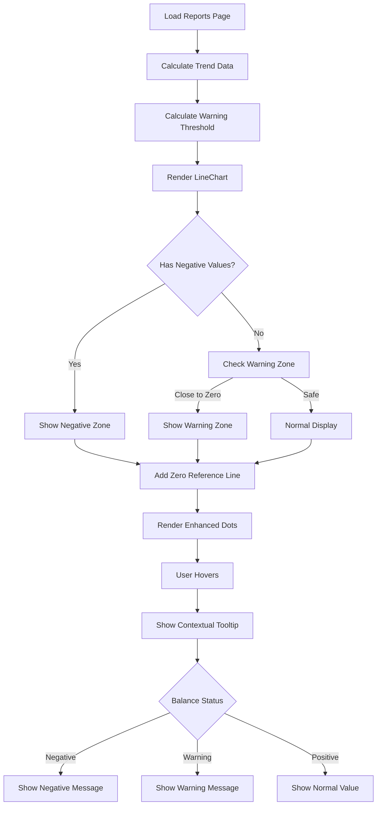

# Negative Balance Chart Indicator - Implementation Plan

## Overview
Add visual indicators to the line chart on the Reports page ([`Reports.tsx`](../frontend/src/pages/Reports.tsx:743)) to show when the projected balance is approaching or has reached negative territory.

## Current State Analysis

### Existing Chart Implementation
The Reports page currently displays a [`LineChart`](../frontend/src/pages/Reports.tsx:749) with three data series:
- **Income** (green line, #10B981)
- **Expenses** (red line, #F43F5E)  
- **Projected Balance** (amber line, #F59E0B)

The chart uses Recharts library components:
- [`LineChart`](../frontend/src/pages/Reports.tsx:749)
- [`CartesianGrid`](../frontend/src/pages/Reports.tsx:750)
- [`XAxis`](../frontend/src/pages/Reports.tsx:751) and [`YAxis`](../frontend/src/pages/Reports.tsx:761)
- [`Tooltip`](../frontend/src/pages/Reports.tsx:772)
- [`Legend`](../frontend/src/pages/Reports.tsx:777)
- Three [`Line`](../frontend/src/pages/Reports.tsx:781) components

### Data Structure
The chart data comes from [`trendData`](../frontend/src/pages/Reports.tsx:44) state:
```typescript
{ 
  month: string;
  income: number;
  expenses: number;
  projectedBalance: number;
}[]
```

The [`projectedBalance`](../frontend/src/pages/Reports.tsx:290) is calculated cumulatively based on:
1. Initial stored balance from accounts
2. Monthly net balance (income - expenses)

## Feature Requirements

### Visual Indicators Needed

1. **Zero Reference Line**
   - Horizontal line at y=0
   - Helps users quickly identify when balance crosses into negative

2. **Warning Zone (Approaching Negative)**
   - Visual indicator when balance is close to zero (e.g., within 10% of zero or a configurable threshold)
   - Subtle visual cue (e.g., light yellow/orange background area)

3. **Negative Zone**
   - Clear visual indicator when balance is negative
   - More prominent visual cue (e.g., light red background area)

4. **Enhanced Line Styling**
   - Consider changing the projected balance line color when it enters negative territory
   - Add visual emphasis to negative data points

## Design Approach: Gradient Areas (Selected)

### Overview
Use SVG gradients to create smooth, visually appealing transitions that indicate when the projected balance is approaching or in negative territory. This approach provides a modern, professional appearance with clear visual cues.

### Visual Design

**Gradient Strategy:**
1. **Background Gradient Area** - Behind the chart, showing zones:
   - **Positive Zone** (Green gradient): Fades from transparent to light green
   - **Warning Zone** (Yellow gradient): Smooth transition from green to yellow
   - **Negative Zone** (Red gradient): Clear red tint for negative values

2. **Line Gradient** - The projected balance line itself uses a gradient:
   - Changes color based on value (green → yellow → red)
   - Provides immediate visual feedback

3. **Zero Reference Line** - Subtle dashed line at y=0 for reference

### Implementation Approach

#### 1. Define SVG Gradients
Create reusable SVG gradient definitions:

```tsx
<defs>
  {/* Background gradient for chart area */}
  <linearGradient id="balanceGradient" x1="0" y1="0" x2="0" y2="1">
    <stop offset="0%" stopColor="#10B981" stopOpacity={0.1} />
    <stop offset="40%" stopColor="#FEF3C7" stopOpacity={0.15} />
    <stop offset="50%" stopColor="#FEF3C7" stopOpacity={0.2} />
    <stop offset="60%" stopColor="#FEE2E2" stopOpacity={0.15} />
    <stop offset="100%" stopColor="#FEE2E2" stopOpacity={0.3} />
  </linearGradient>
  
  {/* Line gradient - changes based on data */}
  <linearGradient id="lineGradient" x1="0" y1="0" x2="0" y2="1">
    <stop offset="0%" stopColor="#10B981" />
    <stop offset="45%" stopColor="#F59E0B" />
    <stop offset="55%" stopColor="#F59E0B" />
    <stop offset="100%" stopColor="#DC2626" />
  </linearGradient>
</defs>
```

#### 2. Apply Gradient to Chart Background
Use Recharts [`Area`](https://recharts.org/en-US/api/Area) component with gradient fill:

```tsx
<Area
  type="monotone"
  dataKey="projectedBalance"
  stroke="none"
  fill="url(#balanceGradient)"
  fillOpacity={0.3}
/>
```

#### 3. Dynamic Line Color Based on Value
Create a custom line component that changes color based on the balance value:

```tsx
const CustomBalanceLine = (props: any) => {
  const { points } = props;
  
  return (
    <g>
      {points.map((point: any, index: number) => {
        if (index === 0) return null;
        
        const prevPoint = points[index - 1];
        const value = point.payload.projectedBalance;
        
        // Determine color based on value
        let strokeColor = '#10B981'; // Green for positive
        if (value < 0) {
          strokeColor = '#DC2626'; // Red for negative
        } else if (value < warningThreshold) {
          strokeColor = '#F59E0B'; // Amber for warning
        }
        
        return (
          <line
            key={`line-${index}`}
            x1={prevPoint.x}
            y1={prevPoint.y}
            x2={point.x}
            y2={point.y}
            stroke={strokeColor}
            strokeWidth={2}
            strokeLinecap="round"
          />
        );
      })}
    </g>
  );
};
```

#### 4. Enhanced Dots with Gradient Effect
Add custom dots that reflect the gradient theme:

```tsx
const CustomDot = (props: any) => {
  const { cx, cy, payload } = props;
  const value = payload.projectedBalance;
  
  let fillColor = '#10B981';
  let strokeColor = '#059669';
  
  if (value < 0) {
    fillColor = '#DC2626';
    strokeColor = '#991B1B';
  } else if (value < warningThreshold) {
    fillColor = '#F59E0B';
    strokeColor = '#D97706';
  }
  
  return (
    <g>
      {/* Outer glow effect */}
      <circle
        cx={cx}
        cy={cy}
        r={6}
        fill={fillColor}
        fillOpacity={0.2}
      />
      {/* Main dot */}
      <circle
        cx={cx}
        cy={cy}
        r={4}
        fill={fillColor}
        stroke={strokeColor}
        strokeWidth={2}
      />
    </g>
  );
};
```

#### 5. Complete Chart Implementation

```tsx
<ResponsiveContainer width="100%" height={250}>
  <LineChart data={trendData} margin={{ left: 0, right: 10, top: 5, bottom: 5 }}>
    <defs>
      {/* Define gradients */}
      <linearGradient id="balanceGradient" x1="0" y1="0" x2="0" y2="1">
        <stop offset="0%" stopColor="#10B981" stopOpacity={0.1} />
        <stop offset="40%" stopColor="#FEF3C7" stopOpacity={0.15} />
        <stop offset="50%" stopColor="#FEF3C7" stopOpacity={0.2} />
        <stop offset="60%" stopColor="#FEE2E2" stopOpacity={0.15} />
        <stop offset="100%" stopColor="#FEE2E2" stopOpacity={0.3} />
      </linearGradient>
    </defs>
    
    <CartesianGrid strokeDasharray="3 3" stroke="var(--color-slate-light, #E2E8F0)" />
    
    {/* Zero reference line */}
    <ReferenceLine
      y={0}
      stroke="#94A3B8"
      strokeDasharray="3 3"
      strokeWidth={1}
      label={{
        value: t('reports.zeroLine'),
        position: 'insideTopRight',
        fill: '#64748B',
        fontSize: 10
      }}
    />
    
    <XAxis
      dataKey="month"
      stroke="var(--color-slate, #64748B)"
      tick={{ fontSize: 10 }}
      tickFormatter={(value) => {
        const [year, month] = value.split('-');
        return `${month}/${year.slice(2)}`;
      }}
      interval="preserveStartEnd"
    />
    
    <YAxis
      stroke="var(--color-slate, #64748B)"
      tick={{ fontSize: 10 }}
      width={50}
      tickFormatter={(value) =>
        new Intl.NumberFormat('pt-BR', {
          notation: 'compact',
          maximumFractionDigits: 0,
        }).format(value)
      }
    />
    
    <Tooltip
      formatter={(value, name, props) => {
        const numValue = Number(value);
        const formattedValue = formatCurrency(numValue, selectedCurrency || 'BRL');
        
        if (name === t('reports.projectedBalance')) {
          const isNegative = numValue < 0;
          const isWarning = numValue > 0 && numValue < warningThreshold;
          
          const status = isNegative
            ? t('reports.balanceIsNegative')
            : isWarning
            ? t('reports.balanceApproachingZero')
            : '';
          
          return [formattedValue, name, status];
        }
        
        return [formattedValue, name];
      }}
      contentStyle={{
        backgroundColor: 'rgba(255,255,255,0.95)',
        backdropFilter: 'blur(8px)',
        borderRadius: '8px',
        border: '1px solid rgba(255,255,255,0.5)',
        fontSize: '12px',
        boxShadow: '0 4px 6px rgba(0,0,0,0.1)'
      }}
      labelStyle={{ fontSize: '12px', fontWeight: 600 }}
    />
    
    <Legend
      wrapperStyle={{ fontSize: '11px', paddingTop: '10px' }}
      iconSize={8}
    />
    
    {/* Background gradient area */}
    <Area
      type="monotone"
      dataKey="projectedBalance"
      stroke="none"
      fill="url(#balanceGradient)"
      fillOpacity={1}
    />
    
    {/* Income line */}
    <Line
      type="monotone"
      dataKey="income"
      stroke="#10B981"
      name={t('common.income')}
      strokeWidth={2}
      dot={{ r: 3 }}
      activeDot={{ r: 5 }}
    />
    
    {/* Expenses line */}
    <Line
      type="monotone"
      dataKey="expenses"
      stroke="#F43F5E"
      name={t('common.expense')}
      strokeWidth={2}
      dot={{ r: 3 }}
      activeDot={{ r: 5 }}
    />
    
    {/* Projected balance line with custom rendering */}
    <Line
      type="monotone"
      dataKey="projectedBalance"
      stroke="url(#lineGradient)"
      strokeWidth={2}
      name={t('reports.projectedBalance')}
      dot={<CustomDot />}
      activeDot={{ r: 6 }}
    />
  </LineChart>
</ResponsiveContainer>
```

### Advantages of Gradient Approach

1. **Visual Appeal**
   - Modern, professional appearance
   - Smooth transitions between states
   - Eye-catching without being overwhelming

2. **Clear Communication**
   - Gradual color change provides intuitive feedback
   - Users can see trends at a glance
   - No abrupt visual changes

3. **Flexibility**
   - Easy to adjust gradient stops for different thresholds
   - Can be customized per user preferences in future
   - Works well with existing color scheme

4. **Performance**
   - SVG gradients are hardware-accelerated
   - No additional DOM elements needed
   - Efficient rendering

### Considerations

1. **Color Accessibility**
   - Ensure gradient colors meet WCAG contrast requirements
   - Test with color blindness simulators
   - Provide alternative indicators (icons, patterns) if needed

2. **Mobile Responsiveness**
   - Gradients may appear differently on small screens
   - Test opacity levels on various devices
   - Adjust gradient stops for mobile if needed

3. **Browser Compatibility**
   - SVG gradients are well-supported
   - Test on Safari, Chrome, Firefox, Edge
   - Provide fallback colors if needed

## Implementation Tasks

### 1. Add Configuration Constants
Create constants for gradient colors and thresholds:
```typescript
const CHART_GRADIENT_COLORS = {
  positive: {
    start: '#10B981',
    end: '#059669',
  },
  warning: {
    start: '#F59E0B',
    end: '#D97706',
  },
  negative: {
    start: '#DC2626',
    end: '#991B1B',
  },
  zeroLine: '#94A3B8',
};

const WARNING_THRESHOLD_PERCENTAGE = 0.1; // 10% of max balance
```

### 2. Calculate Warning Threshold
Add logic to calculate the warning threshold dynamically:
```typescript
const maxBalance = Math.max(...trendData.map(d => d.projectedBalance), 0);
const warningThreshold = maxBalance * WARNING_THRESHOLD_PERCENTAGE;
```

### 3. Create Custom Components
Implement custom React components for:
- `CustomBalanceLine` - Line component with dynamic color based on value
- `CustomDot` - Dot component with gradient effect and conditional styling

### 4. Define SVG Gradients
Add SVG gradient definitions in the chart's `<defs>` section:
- Background gradient for chart area
- Line gradient for projected balance

### 5. Integrate Gradient Components
Replace the existing projected balance [`Line`](../frontend/src/pages/Reports.tsx:799) component with:
- Background [`Area`](https://recharts.org/en-US/api/Area) with gradient fill
- Custom line with dynamic coloring
- Enhanced dots with glow effect
- Zero [`ReferenceLine`](https://recharts.org/en-US/api/ReferenceLine)

### 6. Add Translations
Add new translation keys in [`pt.ts`](../frontend/src/i18n/locales/pt.ts:273), [`en.ts`](../frontend/src/i18n/locales/en.ts), and [`es.ts`](../frontend/src/i18n/locales/es.ts):

**Portuguese ([`pt.ts`](../frontend/src/i18n/locales/pt.ts:273)):**
```typescript
reports: {
  // ... existing keys
  zeroLine: 'Linha Zero',
  negativeZone: 'Zona Negativa',
  warningZone: 'Zona de Atenção',
  balanceApproachingZero: 'Saldo se aproximando de zero',
  balanceIsNegative: 'Saldo negativo',
}
```

**English:**
```typescript
reports: {
  // ... existing keys
  zeroLine: 'Zero Line',
  negativeZone: 'Negative Zone',
  warningZone: 'Warning Zone',
  balanceApproachingZero: 'Balance approaching zero',
  balanceIsNegative: 'Negative balance',
}
```

**Spanish:**
```typescript
reports: {
  // ... existing keys
  zeroLine: 'Línea Cero',
  negativeZone: 'Zona Negativa',
  warningZone: 'Zona de Advertencia',
  balanceApproachingZero: 'Saldo acercándose a cero',
  balanceIsNegative: 'Saldo negativo',
}
```

### 6. Update Tooltip
Enhance the [`Tooltip`](../frontend/src/pages/Reports.tsx:772) to show contextual information when hovering over negative values:
```typescript
<Tooltip
  formatter={(value, name, props) => {
    if (name === t('reports.projectedBalance')) {
      const isNegative = Number(value) < 0;
      const isWarning = Number(value) > 0 && Number(value) < warningThreshold;
      
      return [
        formatCurrency(Number(value), selectedCurrency || 'BRL'),
        name,
        isNegative ? t('reports.balanceIsNegative') : 
        isWarning ? t('reports.balanceApproachingZero') : ''
      ];
    }
    return [formatCurrency(Number(value), selectedCurrency || 'BRL'), name];
  }}
  contentStyle={{ 
    backgroundColor: 'rgba(255,255,255,0.9)', 
    backdropFilter: 'blur(8px)', 
    borderRadius: '8px', 
    border: '1px solid rgba(255,255,255,0.5)', 
    fontSize: '12px' 
  }}
/>
```

## Technical Considerations

### Performance
- The chart already handles 12 months of data efficiently
- Adding reference areas and lines should have minimal performance impact
- Consider memoizing threshold calculations if needed

### Responsive Design
- Ensure visual indicators work well on mobile devices
- Test with different screen sizes
- Adjust opacity and colors for better visibility on small screens

### Accessibility
- Ensure color choices meet WCAG contrast requirements
- Add ARIA labels to reference components
- Provide text alternatives for visual indicators

### Browser Compatibility
- Recharts is well-supported across modern browsers
- Test on Safari, Chrome, Firefox, and Edge
- Verify SVG rendering consistency

## Testing Strategy

### Visual Testing
1. Test with data that has:
   - All positive balances
   - Balances approaching zero
   - Negative balances
   - Mixed positive and negative balances

2. Test with different currencies and account filters

3. Test responsive behavior on:
   - Desktop (1920x1080, 1366x768)
   - Tablet (768x1024)
   - Mobile (375x667, 414x896)

### User Acceptance Criteria
- [ ] Zero reference line is clearly visible
- [ ] Warning zone appears when balance is close to zero
- [ ] Negative zone appears when balance is negative
- [ ] Negative data points are visually distinct
- [ ] Tooltip shows contextual information
- [ ] All translations are correct
- [ ] Chart remains readable and performant
- [ ] Works across all supported browsers
- [ ] Responsive on all device sizes

## Future Enhancements

### Phase 2 (Optional)
1. **Configurable Thresholds**
   - Allow users to set their own warning threshold
   - Store preference in user settings

2. **Alerts**
   - Show notification when projected balance will go negative
   - Email alerts for upcoming negative balance

3. **Historical Comparison**
   - Show previous year's data for comparison
   - Highlight improvement or decline trends

4. **Export with Indicators**
   - Include visual indicators in exported reports
   - Add annotations to exported data

## Branch Strategy

### Branch Name
`feature/negative-balance-chart-indicator`

### Commit Strategy
1. Initial setup: Add constants and translations
2. Add reference components to chart
3. Enhance projected balance line styling
4. Update tooltip with contextual information
5. Add responsive adjustments
6. Update documentation

## Files to Modify

### Frontend
- [`frontend/src/pages/Reports.tsx`](../frontend/src/pages/Reports.tsx) - Main implementation
- [`frontend/src/i18n/locales/pt.ts`](../frontend/src/i18n/locales/pt.ts) - Portuguese translations
- [`frontend/src/i18n/locales/en.ts`](../frontend/src/i18n/locales/en.ts) - English translations
- [`frontend/src/i18n/locales/es.ts`](../frontend/src/i18n/locales/es.ts) - Spanish translations

### Documentation
- This plan document
- Update main README if needed

## Dependencies

### Existing
- `recharts` - Already installed and used
- `react-i18next` - Already installed for translations

### New
- None required

## Estimated Complexity
**Medium** - The feature uses existing Recharts components and follows established patterns in the codebase. The main complexity is in:
1. Calculating appropriate thresholds
2. Ensuring visual clarity across different data scenarios
3. Maintaining responsive design
4. Testing across different currencies and account configurations

## Success Metrics
1. Users can quickly identify when balance approaches or reaches negative
2. No performance degradation on the Reports page
3. Positive user feedback on visual clarity
4. No accessibility issues reported
5. Works consistently across all supported browsers and devices

## Mermaid Diagram: Feature Flow



## Next Steps

1. **Create Branch**: Create the feature branch from main/develop
2. **Review Plan**: Get stakeholder approval on the visual design approach
3. **Implement**: Follow the implementation tasks in order
4. **Test**: Comprehensive testing across scenarios
5. **Review**: Code review and QA
6. **Deploy**: Merge to main and deploy

---

**Created**: 2026-02-09
**Status**: Planning
**Priority**: Medium
**Assigned**: Development Team
