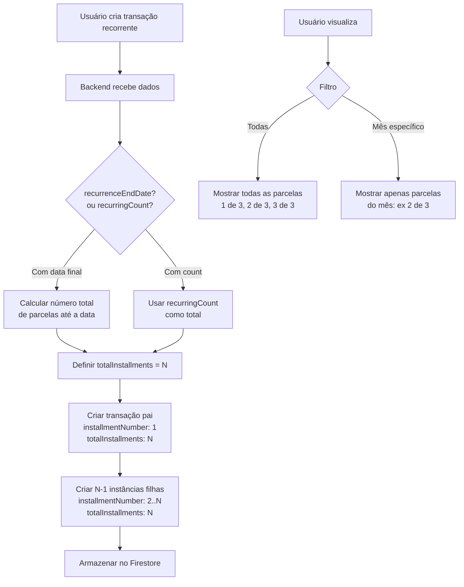

# Plano de Correção: Transações Recorrentes

## Resumo do Problema

O sistema atual cria transações recorrentes incorretamente:
1. Não calcula corretamente o total de parcelas (`totalInstallments`)
2. A transação pai não tem `installmentNumber` nem `totalInstallments`
3. A numeração das parcelas filhas está incorreta

## Requisitos do Usuário

1. **Criação única**: Quando uma transação recorrente é criada, gerar TODAS as instâncias de uma vez (não lazy loading)
2. **Contagem correta**: Se é mensal e acaba em 2 meses, deve haver exatamente 2 transações no total
3. **Exibição no filtro "Todas"**: Mostrar todas as transações com "X de Y" (ex: "1 de 2", "2 de 2")
4. **Exibição no filtro mensal**: Mostrar apenas as transações do mês com "X de Y" absoluto

## Exemplo Esperado

Transação mensal criada em 09/02/2026, terminando em 09/04/2026:
- Total de transações: 3 (Fev, Mar, Abr)
- Filtro "Todas": Mostra 3 transações - "1 de 3", "2 de 3", "3 de 3"
- Filtro "Fev/2026": Mostra 1 transação - "1 de 3"
- Filtro "Mar/2026": Mostra 1 transação - "2 de 3"
- Filtro "Abr/2026": Mostra 1 transação - "3 de 3"

## Problemas Encontrados no Código Atual

### 1. Backend: `backend/src/routes/transactions.ts`

**Problema na função `generateRecurringInstancesWithCount` (linha 222):**
```typescript
totalInstallments: count, // ERRADO: count é recurringCount - 1
```
Se `recurringCount = 3`, então `count = 2`, e `totalInstallments = 2` (deveria ser 3)

**Problema na criação da transação pai (linha 61-66):**
A transação pai não recebe `installmentNumber` nem `totalInstallments`

**Problema na função `generateRecurringInstances` (linha 236-301):**
Não define `installmentNumber` nem `totalInstallments` nas instâncias

### 2. Frontend: `frontend/src/pages/Transactions.tsx`

A exibição "X de Y" depende dos campos `installmentNumber` e `totalInstallments` que estão incorretos ou ausentes.

## Correções Necessárias

### Backend - `backend/src/routes/transactions.ts`

#### 1. Corrigir criação da transação pai (POST /)

```typescript
// Calcular total de parcelas se houver recurringCount
const totalInstallments = recurringCount || 
  (validated.recurrenceEndDate ? calculateFromEndDate(validated) : 1);

const transaction = await firebase.createDocument('transactions', {
  ...transactionData,
  userId,
  createdAt: new Date().toISOString(),
  updatedAt: new Date().toISOString(),
  // Se for recorrente, adicionar metadados da primeira parcela
  ...(validated.isRecurring ? {
    installmentNumber: 1,
    totalInstallments: totalInstallments,
  } : {}),
});
```

#### 2. Corrigir `generateRecurringInstancesWithCount`

```typescript
async function generateRecurringInstancesWithCount(
  firebase: FirebaseService,
  parentTransaction: { id: string; date: string; isRecurring?: boolean; recurrencePattern?: string; recurrenceDay?: number | null; recurrenceEndDate?: string | null; userId: string; description: string; amount: number; type: 'income' | 'expense'; categoryId: string; accountId?: string },
  data: { recurrencePattern?: string | null; recurrenceDay?: number | null; recurrenceEndDate?: string | null; date: string },
  count: number  // Este é o número de instâncias ADICIONAIS a criar
): Promise<unknown[]> {
  const instances: unknown[] = [];
  const startDate = new Date(parentTransaction.date);
  const recurrencePattern = data.recurrencePattern || 'monthly';
  const recurrenceDay = data.recurrenceDay;

  // O total na série inclui a transação pai + as instâncias que serão criadas
  const totalInSeries = count + 1;

  let currentDate = new Date(startDate);

  // Criar exatamente 'count' instâncias
  for (let i = 0; i < count && i < MAX_INSTANCES_PER_REQUEST; i++) {
    // Mover para a próxima ocorrência
    currentDate = getNextDate(currentDate, recurrencePattern, recurrenceDay);
    const dateStr = currentDate.toISOString().split('T')[0];

    // Verificar se já existe instância para esta data
    const existingInstances = await firebase.queryDocuments('transactions', [
      { field: 'parentTransactionId', op: '==', value: parentTransaction.id },
      { field: 'date', op: '==', value: dateStr },
    ]);

    if (existingInstances.length > 0) {
      continue;
    }

    // Criar a instância recorrente
    // installmentNumber: i + 2 porque:
    // - i = 0 → primeira instância filha = parcela 2
    // - i = 1 → segunda instância filha = parcela 3
    const instance = await firebase.createDocument('transactions', {
      userId: parentTransaction.userId,
      accountId: parentTransaction.accountId,
      type: parentTransaction.type,
      amount: parentTransaction.amount,
      categoryId: parentTransaction.categoryId,
      description: parentTransaction.description,
      date: dateStr,
      parentTransactionId: parentTransaction.id,
      isRecurring: false,
      isRecurringInstance: true,
      createdFromRecurring: true,
      recurrencePattern: recurrencePattern,
      installmentNumber: i + 2,        // 2, 3, 4, ...
      totalInstallments: totalInSeries, // Total correto da série
      createdAt: new Date().toISOString(),
      updatedAt: new Date().toISOString(),
    });

    instances.push(instance);
  }

  return instances;
}
```

#### 3. Corrigir `generateRecurringInstances` (função legada baseada em data final)

```typescript
async function generateRecurringInstances(
  firebase: FirebaseService,
  parentTransaction: { id: string; date: string; isRecurring?: boolean; recurrencePattern?: string; recurrenceDay?: number | null; recurrenceEndDate?: string | null; userId: string; description: string; amount: number; type: 'income' | 'expense'; categoryId: string; accountId?: string },
  data: { recurrencePattern?: string | null; recurrenceDay?: number | null; recurrenceEndDate?: string | null; date: string }
): Promise<unknown[]> {
  const instances: unknown[] = [];
  const startDate = new Date(parentTransaction.date);

  let endDate: Date;
  if (data.recurrenceEndDate) {
    endDate = new Date(data.recurrenceEndDate);
  } else {
    const currentYear = new Date().getFullYear();
    endDate = new Date(currentYear, 11, 31);
  }

  const recurrencePattern = data.recurrencePattern || 'monthly';
  const recurrenceDay = data.recurrenceDay;

  // Calcular o total de parcelas na série (pai + instâncias)
  let totalInSeries = 1; // Começa com 1 (a transação pai)
  let tempDate = new Date(startDate);
  tempDate = getNextDate(tempDate, recurrencePattern, recurrenceDay);
  while (tempDate <= endDate) {
    totalInSeries++;
    tempDate = getNextDate(tempDate, recurrencePattern, recurrenceDay);
  }

  let currentDate = new Date(startDate);
  let instanceIndex = 0;

  // Mover para a próxima ocorrência (pular a data do pai)
  currentDate = getNextDate(currentDate, recurrencePattern, recurrenceDay);

  // Criar instâncias até a data final
  while (currentDate <= endDate && instanceIndex < MAX_INSTANCES_PER_REQUEST) {
    const dateStr = currentDate.toISOString().split('T')[0];

    // Verificar se já existe instância
    const existingInstances = await firebase.queryDocuments('transactions', [
      { field: 'parentTransactionId', op: '==', value: parentTransaction.id },
      { field: 'date', op: '==', value: dateStr },
    ]);

    if (existingInstances.length === 0) {
      const instance = await firebase.createDocument('transactions', {
        userId: parentTransaction.userId,
        accountId: parentTransaction.accountId,
        type: parentTransaction.type,
        amount: parentTransaction.amount,
        categoryId: parentTransaction.categoryId,
        description: parentTransaction.description,
        date: dateStr,
        parentTransactionId: parentTransaction.id,
        isRecurring: false,
        isRecurringInstance: true,
        recurrencePattern: recurrencePattern,
        installmentNumber: instanceIndex + 2, // 2, 3, 4, ...
        totalInstallments: totalInSeries,      // Total calculado
        createdAt: new Date().toISOString(),
        updatedAt: new Date().toISOString(),
      });

      instances.push(instance);
    }

    instanceIndex++;
    currentDate = getNextDate(currentDate, recurrencePattern, recurrenceDay);
  }

  return instances;
}
```

### Frontend - `frontend/src/pages/Transactions.tsx`

O frontend já usa a função `formatInstallment` corretamente:

```typescript
const formatInstallment = (transaction: Transaction): string | null => {
  if (!transaction.totalInstallments || transaction.totalInstallments <= 1) return null;
  const current = transaction.installmentNumber || 1;
  return `${current} de ${transaction.totalInstallments}`;
};
```

Desde que o backend envie os campos corretos (`installmentNumber` e `totalInstallments`), a exibição funcionará corretamente.

## Fluxo de Dados Corrigido



## Testes de Validação

### Cenário 1: Transação mensal com data final
- Criar transação em 09/02/2026, terminando em 09/04/2026
- Esperado: 3 transações no total
- Verificar: Todas mostram "X de 3"

### Cenário 2: Transação com recurringCount
- Criar transação com recurringCount = 5
- Esperado: 5 transações no total
- Verificar: Todas mostram "X de 5"

### Cenário 3: Filtro mensal
- Com 3 transações (Fev, Mar, Abr)
- Filtro "Fev": Mostra apenas "1 de 3"
- Filtro "Mar": Mostra apenas "2 de 3"
- Filtro "Abr": Mostra apenas "3 de 3"
- Filtro "Todas": Mostra todas com seus números

## Arquivos a Modificar

1. `backend/src/routes/transactions.ts` - Correções principais
2. `backend/src/types/index.ts` - Verificar se os tipos estão corretos
3. `frontend/src/types/index.ts` - Verificar se os tipos estão corretos

## Notas de Implementação

- A transação pai SEMPRE é a parcela 1
- O `totalInstallments` é o mesmo para todas as transações da série
- A criação é atômica: todas as instâncias são criadas junto com a transação pai
- Se uma criação falhar, devemos considerar rollback ou deixar parcial
