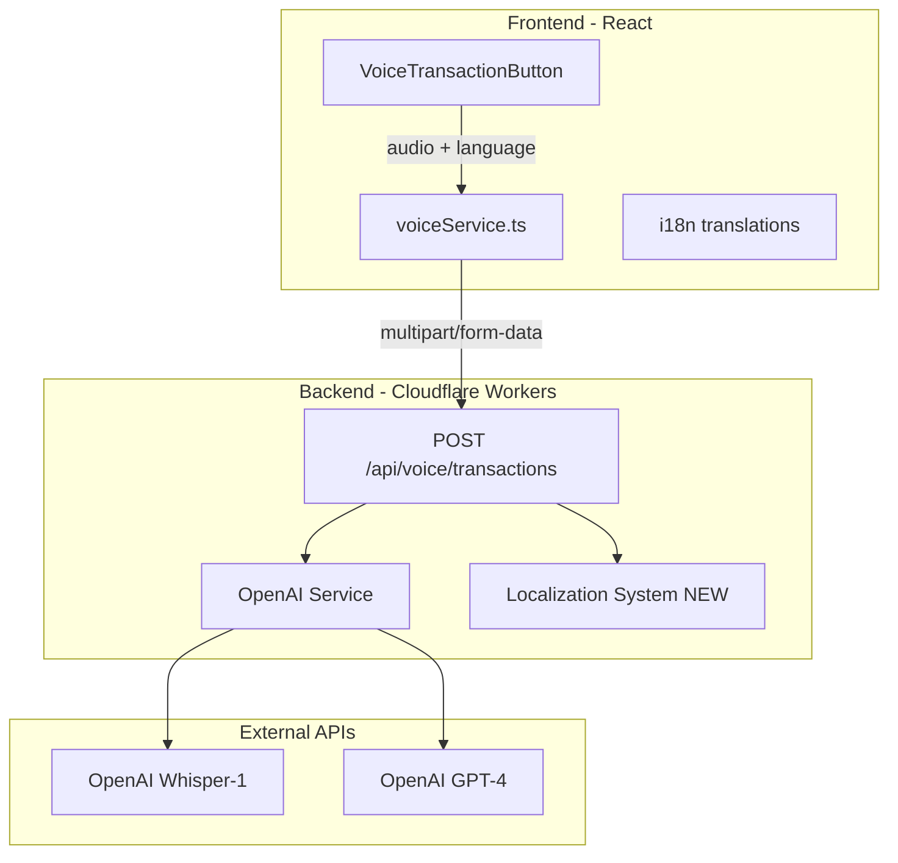

# Voice Feature Localization Plan

## Overview
This plan outlines the changes needed to make the voice transaction feature return values in the user's configured language. This includes:
1. API response messages (success/error) in the user's language
2. Parsed transaction data (descriptions) returned in the user's language

## Current Architecture



## Implementation Steps

### 1. Create Backend Localization System

**New File: `backend/src/i18n/voice-translations.ts`**

Create a simple localization system for backend voice-related messages:

```typescript
export const voiceTranslations = {
  en: {
    errors: {
      noAudioFile: 'No audio file provided',
      emptyAudio: 'Empty audio file',
      transcriptionFailed: 'Failed to transcribe audio',
      noSpeechDetected: 'No speech detected',
      parsingFailed: 'Could not understand the transaction. Please try again.',
      processingFailed: 'Failed to process voice transaction',
    },
    success: {
      transactionCreated: 'Transaction created successfully',
    },
    defaultDescription: 'Voice transaction',
  },
  pt: {
    errors: {
      noAudioFile: 'Nenhum arquivo de áudio fornecido',
      emptyAudio: 'Arquivo de áudio vazio',
      transcriptionFailed: 'Falha ao transcrever áudio',
      noSpeechDetected: 'Nenhuma fala detectada',
      parsingFailed: 'Não foi possível entender a transação. Tente novamente.',
      processingFailed: 'Falha ao processar transação por voz',
    },
    success: {
      transactionCreated: 'Transação criada com sucesso',
    },
    defaultDescription: 'Transação por voz',
  },
  es: {
    errors: {
      noAudioFile: 'No se proporcionó archivo de audio',
      emptyAudio: 'Archivo de audio vacío',
      transcriptionFailed: 'Error al transcribir el audio',
      noSpeechDetected: 'No se detectó voz',
      parsingFailed: 'No se pudo entender la transacción. Inténtalo de nuevo.',
      processingFailed: 'Error al procesar la transacción por voz',
    },
    success: {
      transactionCreated: 'Transacción creada exitosamente',
    },
    defaultDescription: 'Transacción por voz',
  },
};

export type VoiceTranslationKey = keyof typeof voiceTranslations.en.errors | keyof typeof voiceTranslations.en.success;

export function getVoiceTranslation(language: string, key: VoiceTranslationKey, type: 'errors' | 'success' = 'errors'): string {
  const translations = voiceTranslations[language as keyof typeof voiceTranslations] || voiceTranslations.en;
  return translations[type][key as string] || voiceTranslations.en[type][key as string];
}
```

### 2. Update OpenAI Service for Language-Aware Parsing

**File: `backend/src/services/openai.ts`**

Modify the `parseTransaction` method to accept a language parameter and instruct GPT to return the description in that language:

```typescript
async parseTransaction(
  transcription: string,
  categories: Category[],
  language: string = 'en'  // NEW parameter
): Promise<ParsedTransaction> {
  // ... existing code ...
  
  const prompt = `Parse the following voice command into a transaction object.

Available categories:
${categoryList}

Voice command: "${transcription}"

Extract and return ONLY a JSON object with these exact fields:
- amount: number (always positive, extract the numeric value)
- type: "income" or "expense" (determine from context)
- description: string (what the transaction is for, RETURN IN ${language.toUpperCase()} LANGUAGE)
- categoryId: string (match to most appropriate category ID based on description)
- date: string in YYYY-MM-DD format (default to "${today}" if not specified)

IMPORTANT: The description field MUST be returned in ${language.toUpperCase()} language.

Examples:
- "I spent 50 euros on groceries" → {"amount": 50, "type": "expense", "description": "Groceries", ...}
- "Gastei 50 euros em supermercado" (pt) → {"amount": 50, "type": "expense", "description": "Supermercado", ...}

Response must be valid JSON only, no markdown, no explanation.`;

  // ... rest of the method ...
}
```

### 3. Update Voice Route for Localized Responses

**File: `backend/src/routes/voice.ts`**

Import and use the localization system:

```typescript
import { getVoiceTranslation } from '../i18n/voice-translations';

// In the route handler:
app.post('/transactions', async (c) => {
  try {
    // ... existing code to get language ...
    const language = (formData.get('language') as string) || 'en';
    
    // Use translations for error messages:
    if (!audioFile) {
      return c.json(
        { success: false, error: getVoiceTranslation(language, 'noAudioFile', 'errors') },
        400
      );
    }
    
    // ... apply to all error responses ...
    
    // Call parseTransaction with language:
    parsedTransaction = await openai.parseTransaction(transcription, categories, language);
    
    // Return success message in user's language:
    return c.json({
      success: true,
      data: createdTransaction as Transaction,
      transcription,
      message: getVoiceTranslation(language, 'transactionCreated', 'success'),
    }, 201);
    
  } catch (error) {
    return c.json(
      { success: false, error: getVoiceTranslation(language, 'processingFailed', 'errors') },
      500
    );
  }
});
```

### 4. Update Frontend Voice Service

**File: `frontend/src/services/voiceService.ts`**

Update the interface and response handling to include the localized message:

```typescript
export interface VoiceTransactionResponse {
  success: boolean;
  data?: Transaction;
  transcription?: string;
  message?: string;  // NEW: Localized success/error message from backend
  error?: string;
}

// The service already sends language, just ensure it displays the message if provided
```

### 5. Update Frontend Voice Button Component

**File: `frontend/src/components/VoiceTransactionButton.tsx`**

Use the backend-provided message when available:

```typescript
if (result.success && result.data) {
  setFeedback({
    type: 'success',
    message: result.message || t('voice.success'),  // Fallback to local translation
  });
} else {
  setFeedback({
    type: 'error',
    message: result.error || result.message || t('voice.error'),  // Use backend error if available
  });
}
```

### 6. Update Frontend i18n Files

Ensure the frontend has matching translation keys for fallback purposes:

**Files: `frontend/src/i18n/locales/en.ts`, `pt.ts`, `es.ts`**

Already has `voice` section with translations. May need to add backend-specific keys if we want to sync them.

## Summary of Changes

| File | Change Type | Description |
|------|-------------|-------------|
| `backend/src/i18n/voice-translations.ts` | Create | New localization system for backend voice messages |
| `backend/src/services/openai.ts` | Modify | Add language parameter to `parseTransaction` and update GPT prompt |
| `backend/src/routes/voice.ts` | Modify | Use localized messages for all API responses |
| `frontend/src/services/voiceService.ts` | Modify | Add `message` field to response interface |
| `frontend/src/components/VoiceTransactionButton.tsx` | Modify | Use backend messages with fallback to local translations |

## Testing Checklist

- [ ] Test voice transaction in English - verify description is in English
- [ ] Test voice transaction in Portuguese - verify description is in Portuguese
- [ ] Test voice transaction in Spanish - verify description is in Spanish
- [ ] Test error scenarios in each language - verify error messages are localized
- [ ] Test success messages in each language
- [ ] Verify fallback to English works for unsupported languages