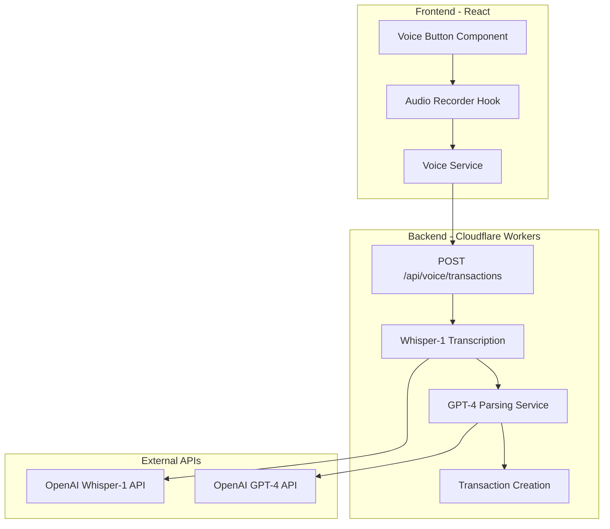

# Voice Transaction Feature - Implementation Plan

## Overview
Add voice input capability to create transactions using OpenAI's Whisper-1 API for speech-to-text and GPT-4 for parsing transaction details.

## Architecture



## Implementation Details

### 1. Backend Changes

**New File: `backend/src/routes/voice.ts`**
- POST `/api/voice/transactions` endpoint
- Accepts multipart/form-data with audio file
- Sends audio to Whisper-1 for transcription
- Sends transcription to GPT-4 to extract:
  - `amount`: number (required)
  - `type`: 'income' | 'expense' (required)
  - `description`: string (required)
  - `categoryId`: string (optional - will match by name)
  - `date`: string (optional - defaults to today)
- Creates transaction directly in Firestore
- Returns created transaction

**New File: `backend/src/services/openai.ts`**
- `transcribeAudio(audioBuffer: Buffer, language: string): Promise<string>`
- `parseTransaction(text: string, categories: Category[]): Promise<ParsedTransaction>`

**Updated: `backend/src/index.ts`**
- Mount voice routes at `/api/voice`

### 2. Frontend Changes

**New File: `frontend/src/hooks/useVoiceRecorder.ts`**
- Hook to handle microphone access
- Record audio using MediaRecorder API
- Return audio Blob and recording state

**New File: `frontend/src/services/voiceService.ts`**
- `sendVoiceTransaction(audioBlob: Blob, language: string): Promise<Transaction>`
- Sends multipart/form-data to backend

**New Component: `frontend/src/components/VoiceTransactionButton.tsx`**
- Button with microphone icon
- Shows recording state (idle, recording, processing)
- Uses useVoiceRecorder hook
- Calls voiceService on record complete
- Shows success/error feedback

**Updated: `frontend/src/pages/Transactions.tsx`**
- Add VoiceTransactionButton near "Add Transaction" button
- Refresh transaction list after voice-created transaction

### 3. i18n Translations

Add to `en.ts`, `pt.ts`, `es.ts`:
```typescript
voice: {
  addByVoice: 'Add by Voice',
  startRecording: 'Tap to record',
  stopRecording: 'Tap to stop',
  processing: 'Processing...',
  success: 'Transaction added successfully',
  error: 'Could not understand. Please try again.',
  permissionDenied: 'Microphone permission denied',
}
```

### 4. Environment Configuration

**Backend (`backend/wrangler.toml`):**
```toml
[vars]
OPENAI_API_KEY = ""
```

**Frontend (`frontend/.env.example`):**
```
# No OpenAI key needed in frontend (goes through backend)
```

## API Contract

### Request
```http
POST /api/voice/transactions
Content-Type: multipart/form-data
Authorization: Bearer <firebase_token>

Form Data:
- audio: <Blob> (webm/opus format)
- language: <string> (e.g., 'pt', 'en', 'es')
```

### Response
```json
{
  "success": true,
  "data": {
    "id": "transaction_id",
    "userId": "user_id",
    "type": "expense",
    "amount": 50.00,
    "categoryId": "category_id",
    "description": "Groceries",
    "date": "2026-02-03",
    "createdAt": "2026-02-03T10:30:00Z",
    "updatedAt": "2026-02-03T10:30:00Z"
  }
}
```

## GPT-4 Prompt Template

```
Parse the following voice command into a transaction object.
Available categories: [list of category names with IDs]

Voice command: "{transcription}"

Extract and return ONLY a JSON object with:
- amount: number (always positive, extract the numeric value)
- type: "income" or "expense" (determine from context)
- description: string (what the transaction is for)
- categoryId: string (match to most appropriate category ID, or empty string if uncertain)
- date: string in YYYY-MM-DD format (default to today if not specified)

Response must be valid JSON only, no markdown.
```

## User Flow

1. User taps microphone button on Transactions page
2. Button shows "Recording..." state
3. User speaks: "Add expense of 50 euros for groceries"
4. User taps again to stop recording
5. Button shows "Processing..." state
6. Backend processes:
   - Audio → Whisper-1 → "add expense of 50 euros for groceries"
   - Text → GPT-4 → parsed transaction object
   - Creates transaction in Firestore
7. Button shows success checkmark briefly
8. Transaction list refreshes with new transaction

## Error Handling

- **Permission denied**: Show message to enable microphone
- **No speech detected**: Ask user to try again
- **Parse error**: Show "Could not understand" message
- **Network error**: Retry or show error message
- **Invalid amount/type**: Ask for clarification

## Security Considerations

- OpenAI API key stored only in backend environment variables
- Audio files are processed in memory, not stored
- All endpoints require Firebase authentication
- Rate limiting should be considered for voice endpoints
